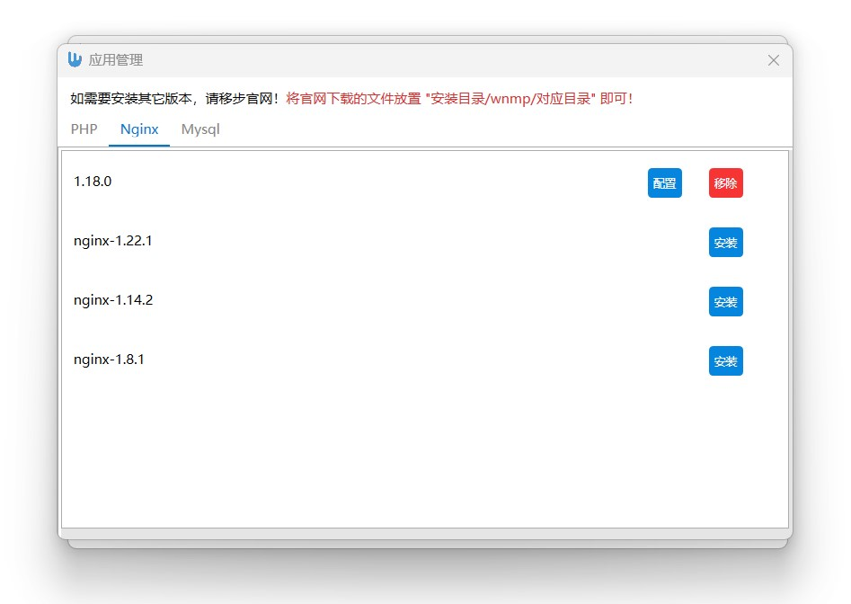

# wnmp

#### 介绍
基于c# wpf，wnmp PHP集成管理
##### 如果应用资源加载失败，请更新安装目录下配置文件wnmp.ini
```ini
appsUrl=https://jianghong008.github.io/wnmp/wnmp-apps.json
```
#### 功能介绍
1. windows平台php集成开发环境。一键管理。
2. 软件版本任意切换（通过本平台下载或自行从官网下载软件），不用担心不会配置，系统自动配置好。
3. php扩展配置可视化，nginx站点可视化配置。

#### 软件截图



